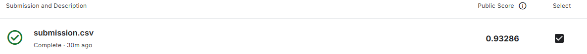

# Formula 1 Pit Stop Prediction

This repository contains a machine learning solution for the [Kaggle Playground Series - Season 6, Episode 5](https://www.kaggle.com/competitions/playground-series-s6e5) competition. The objective is to predict the probability of a driver making a pit stop on the subsequent lap using historical race data and telemetry.

## Competition Performance
* **Public Leaderboard Score:** 0.93286 (AUC-ROC)

## Technical Methodology

### 1. Feature Engineering
The raw dataset was processed using a dedicated pipeline to extract temporal dependencies and performance trends:
* **Sorting & Grouping:** Data is organized by `Driver`, `Race`, and `LapNumber` to ensure chronological integrity during feature derivation.
* **Degradation Delta:** Calculation of the discrete difference in `Cumulative_Degradation` per driver/race to monitor the instantaneous rate of tire wear.
* **Rolling Performance Metrics:** Implementation of a 3-period rolling mean for `LapTime (s)` to smooth out noise and capture pace evolution.
* **Missing Value Imputation:** Zero-filling of initial sequence values (resulting from `diff` and `rolling` operations) to maintain dataset consistency.

### 2. Modeling Framework
* **Algorithm:** LightGBM
* **Categorical Handling:** Direct utilization of native categorical support for high-cardinality variables (`Driver`, `Compound`, `Race`)
* **Hyperparameter Optimization:** Automated tuning via **Optuna** to maximize the Area Under the ROC Curve.

### 3. Validation Strategy
* **Methodology:** 3-fold Cross-Validation with Out-of-Fold (OOF) prediction generation.

## Environment & Implementation

### System Specifications
* **Language:** Python 3.12.6

### Repository Structure
* `pitstop.ipynb`: Comprehensive notebook containing the `prepare_features` pipeline, training logic, and evaluation metrics.
* `requirements.txt`: Environment dependencies.

## Usage
1. Clone the repository.
2. Install dependencies: `pip install -r requirements.txt`.
3. Ensure the Kaggle dataset is placed in the designated directory.